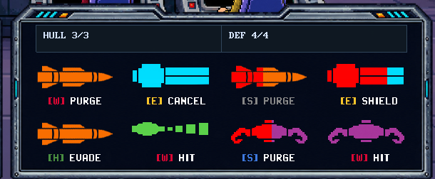

# Space Captain — Threat Dashboard

Current durable design contract for the captain's incoming-threat UI.

Reference composition image:



The image is a layout/state reference, not a literal command-mapping specification. Several action labels in the mock
were intentionally mixed to test role colors, disabled state and `CANCEL`.

## Goal

Incoming threats should be readable as **large concrete objects**, not miniature data cards.

The player should be able to answer almost instantly:

- what threats exist;
- which one is becoming urgent;
- what officer/action responds to it;
- whether that action is currently available or already running.

Persistent tactical explanation belongs on the captain dashboard. The viewscreen remains physical/world-space combat.

## Concrete identity

One runtime threat maps to one UI object.

Do not aggregate away concrete threat identity merely to simplify layout.

Current threat families:

- Missile;
- Beam Cannon;
- Sticky Mine;
- SPAM.

Basic threat facts are free. Player Science TRACK/IDENTIFY is not part of this UI.

## Layout

Current target layout is a **4 x 2 grid** on the right `CURRENT CONTEXT` display.

This supersedes the old 3x2 `163x66` framed-card layout.

A threat cell contains only the visual information that earns its space:

```text
[ LARGE THREAT GLYPH ]
[role] ACTION
```

No permanent card frame/background is required around each cell.

The grid should feel like a bank of compact warning/command symbols, not an inventory screen or spreadsheet.

## Threat glyph asset contract

Current authored sources:

```text
assets/raw/images/ui/threat_icons/missile.png
assets/raw/images/ui/threat_icons/beam_cannon.png
assets/raw/images/ui/threat_icons/mine.png
assets/raw/images/ui/threat_icons/spam.png
```

All use a `107 x 33` source canvas.

Preferred source treatment:

- transparent PNG;
- white/tintable visible shape;
- transparent internal cuts;
- no baked gameplay color;
- no duplicate red terminal variant.

Runtime color identity:

- Missile -> orange;
- Beam -> cyan;
- Mine -> violet;
- SPAM -> green;
- urgency/terminal overlay -> red.

Small dashboard glyphs prioritize silhouette/readability over forced detailed pixel art. Final art can be revisited later;
the current production language is intentionally flat, blocky and clean.

## Canonical threat/action mapping

```text
Missile      -> [W] HIT
Beam Cannon  -> [E] SHIELD
Sticky Mine  -> [E] CLEAR
SPAM         -> [S] PURGE
```

The colored role key identifies the officer. The command text stays uniform white when available.

Helm `EVADE` remains a ship/global combat action rather than a per-threat command.

## Whole cell = action

There is no separate drawn button inside the threat cell.

The whole threat cell is the click target.

### Available

- threat glyph presents threat color/progress normally;
- officer key uses officer color;
- action text is white;
- whole cell is interactive.

### Active cancellable task

- action label becomes `CANCEL`;
- whole cell remains interactive;
- click cancels the real active engine task.

Do not add a second cancel button.

### Unavailable

Examples include:

- required officer busy/absent/blocked;
- no required ammo;
- insufficient Power Core/resource;
- another engine rule makes the command unavailable.

Presentation:

- action label becomes gray/non-interactive;
- threat glyph does **not** become gray merely because the response is unavailable;
- threat urgency continues to progress normally.

Threat urgency and action availability are intentionally separate visual channels.

## No numeric countdown

The new grammar does not show seconds.

Do not restore:

- exact ETA text;
- `NO ID / GUESS / LOCK`;
- Science TRACK labels;
- button-local segmented timing strips;
- large card borders/dividers merely to frame the glyph.

## Universal glyph progress

Timing lives **inside the glyph itself**.

Use one universal visual grammar for all threat families.

### Useful-response phase

The normal threat-color glyph remains visible.

A red copy of the same glyph fills **left -> right** as the latest useful start approaches.

Conceptually:

```text
0% red                               100% red
[ threat color -------------------------- ]
[ RED >>>>>>>>>>>>>>>>>>>>>>>>>>>>>>>>>> ]
```

The fill answers:

> how far through the useful response-start window are we?

It is **not** generic time-to-impact.

### Terminal phase

When the latest useful start has passed:

- the entire glyph is red;
- the full red glyph blinks;
- terminal state is shown even if the player already started the counter-task in time and that task is still running.

This is intentional. It creates tension around whether a committed countermeasure will resolve before the physical
threat lands.

Terminal timing remains presentation advice. The view must not invent command illegality that the engine does not own.

## Timing source

The view does not import content tuning or reconstruct task-duration/slowdown math.

The engine presentation/read model owns latest-useful-start timing based on real state, including the current
crew-progress multiplier.

The new universal glyph grammar requires an actionable timing deadline for:

- Missile HIT;
- Beam SHIELD;
- Mine CLEAR;
- SPAM PURGE.

The old UI intentionally omitted a SPAM precision strip. If the current presentation snapshot lacks a SPAM useful-start
deadline, add it at the engine presentation boundary rather than calculating it in Phaser.

## Beam Shield nuance

Beam defense has a finite Shield lifetime and historically exposed a bespoke `TOO EARLY -> VALID -> TOO LATE` strip.

The new dashboard intentionally does **not** preserve that chart by default.

Current rule:

- keep the universal glyph-progress language;
- preserve real engine Shield timing/legality;
- if early deployment creates a real readability problem in runtime, solve that concrete problem with the smallest
  affordance that works;
- do not restore a special Beam-only timing visualization merely for symmetry with old code.

The existing HULL/DRIVE Shield target picker remains real and should survive the tile rewrite.

## Suggested render construction

Because source glyphs are white/tintable, one texture can provide both normal and red states.

Preferred construction:

```text
base image      -> tint to threat family color
red overlay     -> same image, tint red, clip/mask left -> right
```

At terminal state the red overlay covers the full glyph and blinks.

Use the simplest Phaser clip/mask mechanism that behaves correctly with packed/trimmed frames. Do not create duplicate
mutable timing state in the view.

## Viewscreen rule

The viewscreen shows physical combat:

- ships;
- incoming/outgoing Missiles;
- attached/approaching Mines;
- Beam charge/fire;
- SPAM effects;
- Shields/impacts;
- short-lived VFX.

Persistent tactical explanation belongs on the dashboard.

Do not reintroduce:

- projectile countdown text floating in space;
- persistent targeting frames around every threat;
- floating threat IDs;
- giant telemetry overlays over the viewscreen.

## Deferred information-denial experiment

A future enemy EW/EMP-like effect may temporarily hide **precision timing** without removing player agency.

Promising experiment:

- about 4–5 seconds;
- threat glyphs remain;
- action labels/clicks remain;
- red progress masks disappear;
- physical telegraphs become the player's rough timing source;
- actual gameplay timers continue unchanged;
- terminal full-red blink may remain as a coarse emergency signal.

This is explicitly deferred until the normal dashboard is implemented and playtested.

## Runtime readability rule

Actual-size perception is part of balance.

Judge the dashboard at real 1280x720 runtime scale with mixed/full threat boards. Do not tune durations or add detail
based only on zoomed screenshots.
