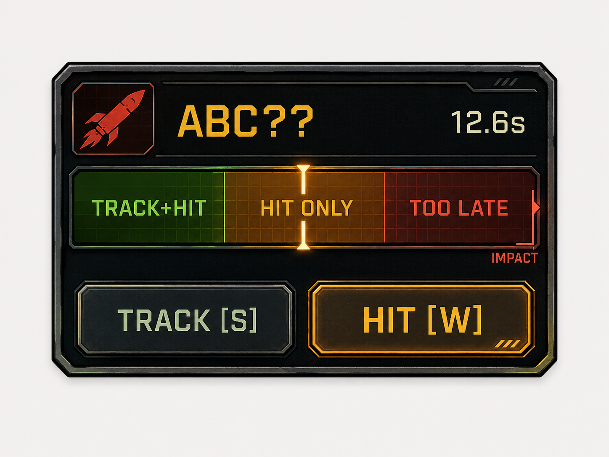

# Space Captain — Threat Panel

Design contract for the compact combat-threat UI. This does not imply that the
final UI is already implemented.

Reference composition image:



The image explains composition only; production art/layout may change.

## Goal

Persistent combat information belongs on the captain dashboard rather than as
labels, timers or targeting frames floating over the viewscreen.

One concrete runtime threat maps to one compact fixed-footprint tile.

Target density:
- roughly 4 tiles comfortable;
- 5 still viable under pressure;
- roughly 4:3 rather than a panoramic spreadsheet row.

Do not aggregate away concrete threat identity.

## Tile anatomy

Preferred hierarchy:
1. threat-type icon;
2. identity / Science knowledge;
3. urgency timeline;
4. contextual actions;
5. raw countdown as secondary precision.

A useful layout is:
- top: icon + signature/target label + small time;
- middle: urgency timeline;
- bottom: compact action buttons.

## Missile identity

Every concrete missile/projectile gets one stable display signature.

Presentation receives only safe observer/Science knowledge:
- `?????` — UNKNOWN;
- `ABC??` — UNCERTAIN;
- `ABCDE` — CONFIRMED.

Objective hidden missile truth remains engine-owned.

## Missile actions

Current conceptual slots:
- `TRACK [S]` — Science;
- `HIT [W]` — Weapons.

TRACK:
- available for UNKNOWN;
- may remain available for UNCERTAIN so Science can track again;
- disappears once CONFIRMED.

HIT is the Weapons response while interception is still possible.

The view must not recreate command legality. Button availability comes from
engine/app command truth.

## Beam Cannon threats

Use the same tile grammar for Beam Cannon threats.

The identity slot may show a real semantic target such as `HULL`, `BRDG`,
`DRIVE` or another domain-supported target.

Do not derive semantic target names from VFX coordinates.

## Urgency timeline

The primary signal is the remaining **decision window**, not raw seconds.

Threat progress moves left -> right toward impact/resolution.

Three semantic windows:

### Safe — TRACK + HIT

Enough time remains to complete the relevant Science tracking response and then
the Weapons interception response.

### Caution — HIT ONLY

TRACK + HIT no longer fits, but direct interception still does.

### Too late

The normal interception response can no longer finish before impact.

Preferred presentation:
- one compact horizontal bar;
- visually distinct windows;
- one clear moving marker;
- clear impact endpoint;
- small raw countdown nearby.

Do not fill the production bar with large explanatory labels unless onboarding
proves they are necessary.

## Dynamic thresholds

Timeline boundaries come from real gameplay timing, never arbitrary fixed
seconds.

Conceptually:

```text
TRACK+HIT boundary
    = remaining tracking time
      + remaining interception time

HIT-only boundary
    = remaining interception time
```

Officer occupancy, impairment, SPAM modifiers and future timing bonuses must be
resolved from authoritative command/task timing. The view must not guess.

## Multi-threat acceptance test

Before locking the UI, test:
- 4 simultaneous threats;
- 5 simultaneous threats;
- mixed missile + Beam threats;
- UNKNOWN / UNCERTAIN / CONFIRMED identities;
- different urgency windows at once;
- TRACK hidden when no longer relevant;
- multiple actionable buttons without visual noise.

The captain should be able to answer quickly:
- what is it?
- how well do we understand it?
- how urgent is it?
- what can I still do?

## Viewscreen rule

The viewscreen shows physical combat: ships, missiles, Beam/SPAM effects,
shields, impacts and short-lived VFX.

Persistent tactical explanation belongs in the dashboard.

Do not reintroduce:
- projectile countdown text on the viewscreen;
- persistent targeting frames around threats;
- floating threat IDs;
- giant HP/telemetry overlays over space.
